# CareSync
**JavaScript and Tailwind CSS integrated directly into the HTML files.**

## CareSync — AI-Powered Family Healthcare Coordination Platform
### *Because Caring Should Never Feel Far Away*

CareSync is an AI-powered family healthcare coordination platform designed to help families remotely support the health and well-being of their elderly parents.

The platform combines **healthcare reminders, medication management, family monitoring, personalized voice reminders, and an AI Care Assistant** into one simple system. It helps family members stay informed about important healthcare activities even when they live far away.

---

## 🖥️ Project Preview

### 🏠 Home Page
The landing page introduces CareSync and highlights its goal of making remote elderly care easier and more connected.

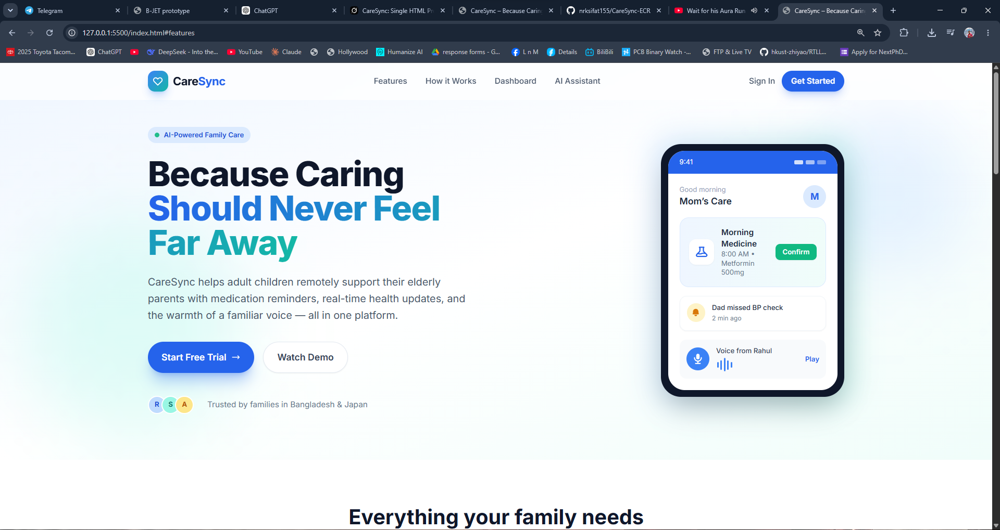

---

### 🤖 AI Care Assistant
The AI Care Assistant provides a conversational interface where users can ask general healthcare-related questions and receive supportive information.

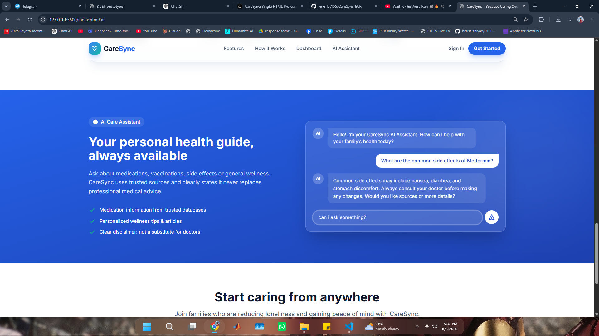

---

### 📊 Family Dashboard
The Family Dashboard gives family members a quick overview of their loved ones' healthcare activities, including completed, pending, and missed tasks.

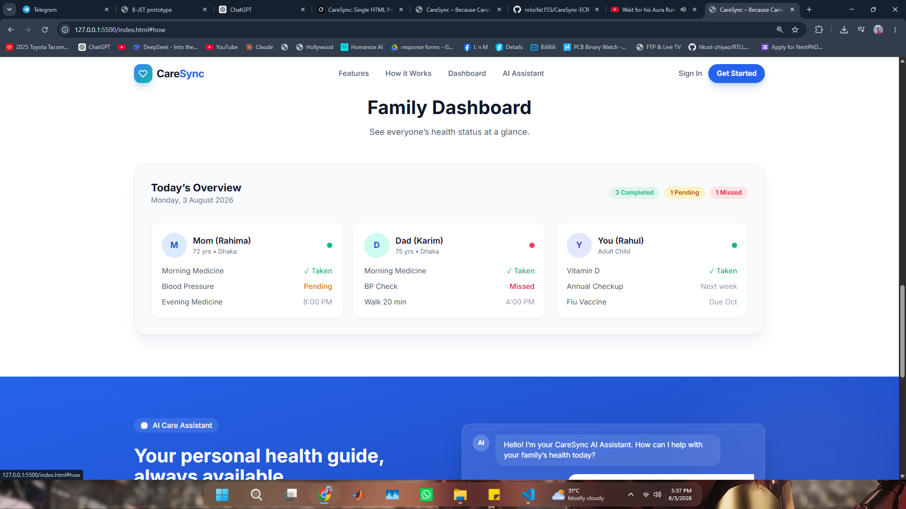

---

### 🔐 Sign In
The Sign In page provides the authentication interface for accessing the CareSync platform.

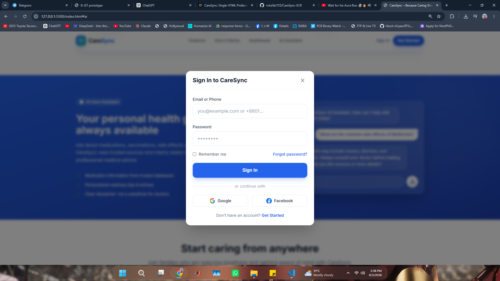

---

### 👴 Parent Side – Notification View
Elderly-friendly interface designed with large buttons, high contrast, and simple layout. Parents can easily mark medicines as taken and receive personal voice reminders from their children.

**Key Features:**
- Large “I Took My Medicine” button
  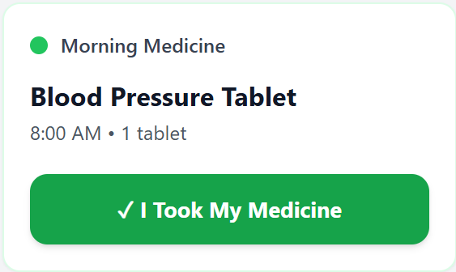
- Clear medicine schedule with status
  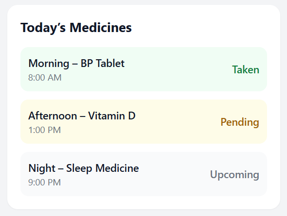
- Voice message playback from family members
  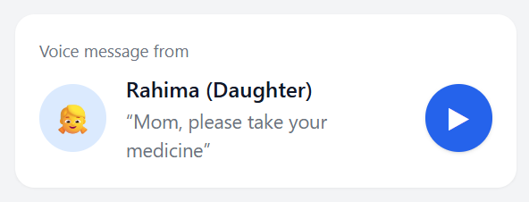
- Simple and accessible design for elderly users
  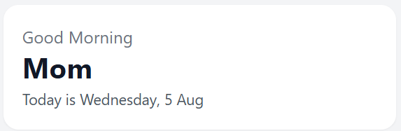

---

### 👨‍👩‍👧 Child Side – Notification View
Family members can monitor their parents’ medication status in real-time, receive alerts for missed doses, and send personalized voice reminders with one tap.

**Key Features:**
- Live status summary (Taken / Pending / Missed)
  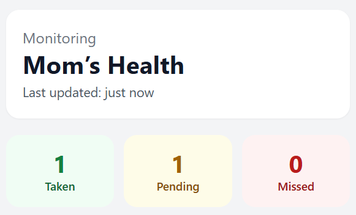
- Real-time notifications and One-tap “Send Voice Reminder” button
  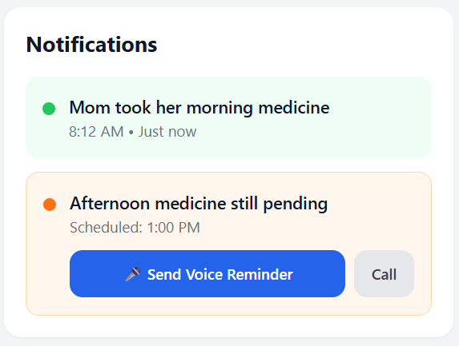
- Emergency contact option (999)
  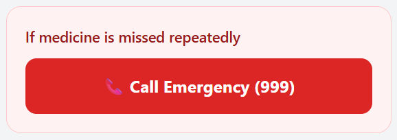
- Today’s full medication schedule
  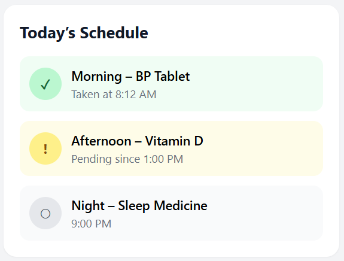
---

## ✨ Main Features

- 💊 Medication and healthcare activity tracking
- 🔔 Healthcare reminders and notifications
- 👨‍👩‍👧 Family healthcare monitoring
- 🎙️ Personalized family voice reminders
- 🤖 AI Care Assistant
- 💉 Vaccination and routine checkup tracking
- 👴 **Elderly-friendly Parent Dashboard** (Large buttons & high contrast)
- 📱 **Child Notification Dashboard** with real-time alerts
- 🆘 Emergency escalation support

---

## 🎨 Design Principles (Parent Side)

- Large touch targets (64px+ buttons)
- High contrast colors
- Big readable fonts (20–24pt)
- Minimal cognitive load (one primary action per screen)
- Clear visual feedback
- Simple and forgiving interface

---

## 🚧 Project Status
**Prototype**

CareSync currently demonstrates the core concept and user interface of the proposed family healthcare coordination platform.

> **CareSync — Because Caring Should Never Feel Far Away.**
